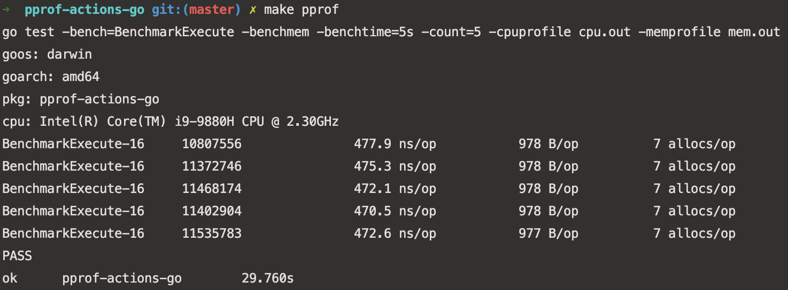
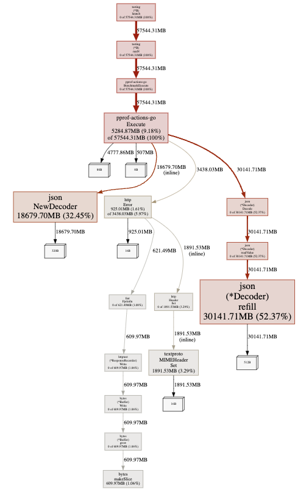
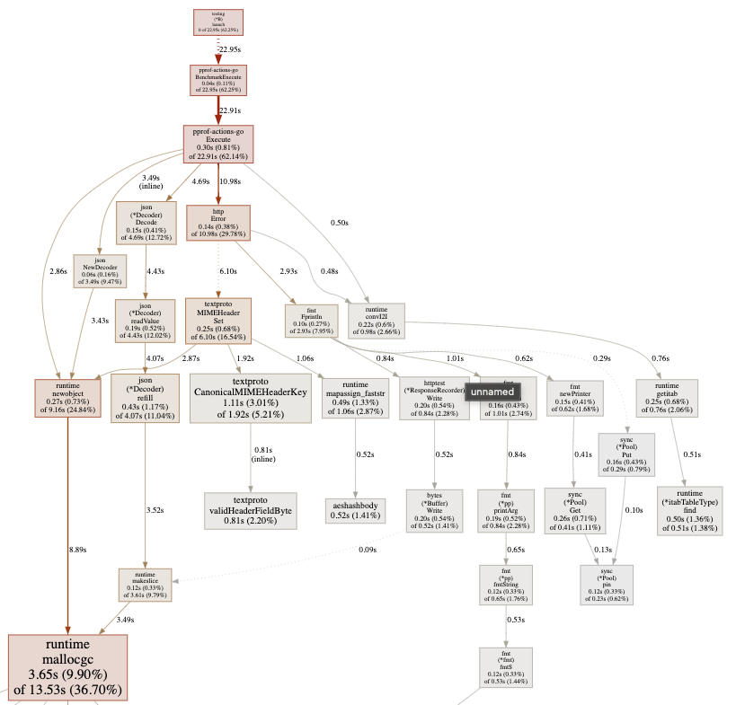

[](https://codecov.io/gh/ruauka/pprof-actions-go)
[](https://github.com/ruauka/pprof-actions-go/actions/workflows/pipeline.yml)
## Overview
Pet-project.
Go service which calculates the loan overdue.


## Content
- [Start](#start)
- [Pprof](#pprof)
- [DevOps](#devops)

## Start

To start project run command in terminal:

```bash
make build
```
```bash
make run
```

To stop, run command:

```bash
make remove
```

To check alive of service make GET request on http://localhost:8080/health. If service is alive you get JSON:

```bash
{
    "status": "ok"
}
```

To get calculation send a POST request to http://localhost:8080/execute.
The example of request JSON is in directory:

```bash
testdata/input.json
```

## Pprof

Service has benchmarks and a pprof profiler.

To start `pprof` run the command in terminal:
```bash
make pprof
```
Example result:
<p align="left">
    
</p>

To check `memory` usage run the command in terminal:
```bash
make pprof-mem
```
Example result:
<p align="left">
    
</p>

To check `cpu` usage run the command in terminal:
```bash
make pprof-cpu
```
Example result:
<p align="left">
    
</p>

## DevOps
Service has 2 deploy options:
1. GitHub-Actions(default option for project): folder `.github`.
    Stages are:
    - Testing
    - Linting
    - Build service image and push in Dockerhub registry
    - Pull and deploy image on VPS

2. Jenkins: file `Jenlinsfile`.
   Stages are:
    - Testing
    - Linting
    - Build service image push in Nexus registry
    - Pull and run service locally

For second option Jenkins and Nexus require.
